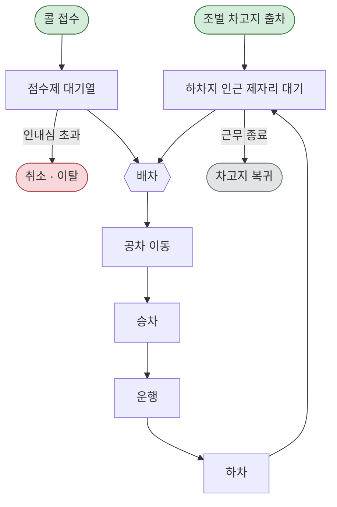

# 모델 흐름도

서울 장애인콜택시 배차·운행 하루를 재생하는 이산사건 모델의 프로세스 흐름이다.
개체는 **콜**과 **차량** 둘이고, 아래 흐름은 두 개체가 만나는 지점(배차)을 축으로 그렸다.

가정 부호(A-01 · A-09 · A-11)의 정의는 [ASSA 로그](assa_log.md) 에 있다.

---

## 프로세스 흐름

**읽는 법**

- 왼쪽 위 `조별 차고지 출차` 는 **차량**의 진입점, `콜 접수` 는 **콜**의 진입점이다.
- 두 개체는 `배차` 에서 만난다. 차량은 `하차지 인근 제자리 대기` 에서, 콜은
  `점수제 대기열` 에서 배차를 기다린다.
- `하차 → 제자리 대기 → 배차` 가 **순환 고리**다. 차량은 근무 시간 동안 이 고리를 돈다.
  **차고지로 돌아가지 않는다** — 하차한 자리 근처에서 다음 콜을 기다린다(가정 A-01).
- **이탈 경로는 하나다.** 대기열에서 인내심을 초과한 콜이 `취소·이탈` 로 빠진다.
  차량 쪽에는 이탈이 없다(고장·결행을 모델링하지 않는다).
- 차량은 근무 종료 시각에만 `차고지 복귀` 로 모델을 벗어난다.

---

## 조 편성 (실측 재구성, 차량-일 16.9만 건)

차량의 진입 시각과 근무 길이는 가정이 아니라 실측에서 역추정한 값이다(가정 A-09).
**차량-일 169,446건**(특장차 한정 · A-16)의 첫 승차·마지막 하차 분포이며, 산출 경로와
필터별 잔존 건수는 [provenance.md 8절](provenance.md) 에 있다.

| 조 | 출차 시각 | 차량-일 비중 | 조별 종료 중앙 | (구 · 전체) |
|---|---|---|---|---|
| 1조 | 07시 | **28.4%** | 14시 | 25.7% |
| 2조 | 08시 | **24.3%** | 15시 | 20.8% |
| 3조 | 12시 | **23.8%** | 18시 | — |
| 4조 | 13시 | **6.0%** | 19시 | 5.0% |
| 5조 | 15시 | **3.3%** | 22시 | — |

근무 길이 중앙 **6.72시간**, 사분위 5.39~7.71시간.

위 5개 시각이 차량-일의 **85.8%** 를 덮는다. 

**구 3조(10시 11.8%)가 사라졌다.** 임차택시는 첫 운행이 10시에 61.1% 몰린 단일
봉우리이고, 특장차만 보면 10시는 2.0%다. **그 봉우리는 임차택시 몫으로 보인다.**
특장차의 출차는 **07 / 08 / 12시 세 봉우리**이며 이것이 A-16(임차택시 분리)의 핵심
근거다. 두 체계를 섞으면 어느 쪽의 교대 구조도 재현되지 않는다.

**한계 — 확정할 수는 없다.** 대조 근거인 2012~13년 공문이 출차 07/08/10/12시를
적으면서 **차량 유형을 구분하지 않는다.** 공문이 전체 운영을 기술한 것이라면 10시가
빠지는 게 정합적이고, 특장차만을 기술한 것이라면 그 사이 운영이 바뀐 것이다. 어느
쪽인지 가릴 자료가 없다. **다만 07/08/12시가 공문과 그대로 일치하므로 시차 운행이라는
가정(A-09) 자체는 유지한다** — 흔들린 것은 조의 개수·시각 구성이지 시차 운행의
존재가 아니다.

**한계** — 가동시간을 첫 승차~마지막 하차로 잡으므로 출근 후 첫 콜까지와 마지막 하차 뒤
퇴근까지가 빠진다. **실제 출차는 이보다 이르고 귀고는 이보다 늦다.** 조 편성을 5개 조로
묶는 규칙은 코드에 없다 — 자세한 내용은
[`external_sources.md` B-7](external_sources.md).

**차량 대수는 723이 아니다.** 723은 연간 누적 고유 차량번호이고, 723은 연간 누적 고유 차량번호이고, 시뮬은 평일 574 / 주말 374를 요일별로 적용한다(metrics.daily_active_vehicles()). 

---

## 단계 → 모듈·함수 대응

| 단계 | 담당 모듈·함수 |
|---|---|
| **조별 차고지 출차** | 거점 좌표·정원 `load.load_depots()` (44곳, 691대) / 조 편성 실측 `load.load_vehicle_trips()` → `metrics.vehicle_day_table()` / 차량 대수 `metrics.daily_active_vehicles()`. `simulator.allocate_fleet()` 이 배속 정원 비율로 일별 가동 대수를 나누고(최대잉여법, 거점당 최소 1대), `build_shifts()` 가 실측 분포에서 출차·종료 시각을 뽑는다 |
| **콜 접수** | `load.load_calls()` — 즉시콜·서울 필터 후 **1,222,330건**(특장차 한정 · A-16). 각 행의 `received_at` 이 도착 이벤트, `origin_dong_canon`·`origin_lat/lon` 이 발생 위치 |
| **점수제 대기열** | `CallTaxiSim._match_for_vehicle()` / `_match_for_call()` — 점수 = 접수순서 15 + 경과대기 35 + 거리 40(`SCORE_W`). 거리항은 좌표가 아니라 **이동시간(분)**, 탐색 반경은 직선거리 7 / 8 / 12km. **각 항은 후보 집합 안에서 정규화한다** — 절대 상한의 근거가 없어서다(A-18, 민감도 대상) |
| **배차** | 이벤트마다 국소 매칭 — 콜이 오면 그 콜에 맞는 차를, 차가 비면 그 차에 맞는 콜을 찾는다 |
| **공차 이동** | `travel_time.get_travel_time(출발동, 목적동, hour, is_weekend)` — 대기 위치 동 → 승차지 동. 3단 폴백(실측 OD → 거리대 속도 → 시간대 평균속도), 반환값 1~120분 |
| **승차 · 하차** | `CallTaxiSim._vehicle()` |
| **운행** | `travel_time.get_travel_time()` — 승차지 동 → 목적지 동. 공차 이동과 같은 테이블을 쓴다 |
| **하차지 인근 제자리 대기** | `CallTaxiSim._vehicle()` — 하차 후 위치를 목적동으로 옮기고 다음 배차를 기다린다(A-01). **유휴 ≠ 가용은 미반영** — 식사·교대·충전이 없어 유휴 차량이 전부 배차 가능하다 |
| **취소 · 이탈** | **실측 분류** `metrics.cancel_kind()` — 배차 전 + 1분 초과 취소를 `abandoned` 로 분류. **시뮬 샘플링** `outputs/patience_km.csv` — 인내심 KM 생존곡선에서 역CDF로 뽑는다(A-14). 접수 시 즉시 취소를 외생 확률 3.16% 로 먼저 뽑고, 나머지는 인내심 시각 전에 배차되지 못하면 취소한다. 배차 후 취소는 배차 시점에 3.74% 로 판정 |
| **차고지 복귀** | `CallTaxiSim._vehicle()` — 근무 종료 시 위치만 차고지로 되돌린다(이후 배차 대상 아님) |
| **하루 실행·로그 산출** | `CallTaxiSim.run()`, `run_placement(placement, calls, depots, travel_time, seed)`. 로그는 **입력 콜과 같은 컬럼 구조**라 `metrics` 를 그대로 통과한다 |
| **결과 채점** | `metrics.overall_metrics()` → `metrics.compare_to_target()` — 판정 5개(픽업 3 + 취소율 + 픽업 지니) 대조. 시뮬 로그도 실측 콜과 같은 함수를 통과한다 |

재생하지 않는 것은 `simulator.KNOWN_GAPS` 에 모아 뒀다 — 유휴≠가용, 조별 종료의
분포, 광역콜의 경기 체류, 차량 고장.

### 실행 성능과 재현도

**실행 시간**(공휴일 없는 주 기준, 이동시간 행렬 빌드 11초는 1회):
하루 4,065콜 0.5초 · 일주일 24,871콜 2.9초 · 한 달 100,942콜 17.4초.
약 5,800콜/초로 콜 수에 선형이라 **연간 재생도 4분 안쪽**이다. 재생 기간이
후보 개수를 제약하지 않는다.

**검증을 통과하지 못한다.** 판정 5개 중 픽업 지니만 허용오차 안에 들고, 픽업은
실측의 53%(중앙 9.45 vs 17.76분), 총 대기는 39% 수준이다. 원인은 매칭 미재현
(A-19)과 배차 선택(A-20)이며 **공급 부족은 아니다** — 동시 유휴가 θ 없이 이미
실측과 맞는다(163.5 vs 164.6대). 진단은 아래 절.

**그래도 후보를 돌린 이유** — 공간 구조가 재현되기 때문이다(픽업 지니 0.0805 vs
실측 0.0751). 동 간 격차 구조가 맞으므로 **후보 간 상대 비교는 유효하고**, 절감폭의
절대 크기만 신뢰할 수 없다. 244곳 × 시드 3회 결과는 아래 「실행 결과」 절.

### 왜 대기가 짧은가 — θ 를 훑어보고 얻은 결론 (2026.08.09)

A-01 의 잔여 조치였던 **θ(유휴/비가용 임계)를 30~180분으로 훑었다.** 휴게 길이는
자유 파라미터로 두지 않고 실측 유휴 구간의 초과분에서 뽑았으므로(`IdleBreak`)
손잡이는 θ 하나다. 재생 구간은 2025-05-12 주.

| θ | 매칭 | 총 대기 | p90 | 취소율 | 포기 | 동시 유휴 최대 | 지니 |
|---|---|---|---|---|---|---|---|
| 없음 | 5.4 | 17.7 | 39.2 | 5.4% | 2.1% | **163.5** | 0.12 |
| 180 | 5.6 | 17.9 | 39.2 | 5.5% | 2.1% | 159.6 | 0.12 |
| 120 | 6.3 | 18.8 | 40.9 | 5.8% | 2.4% | 158.2 | **0.11** |
| 60 | 8.4 | 21.1 | 47.8 | 6.8% | 3.4% | 153.6 | 0.12 |
| 30 | 11.7 | 24.7 | 58.2 | 8.1% | 4.6% | 148.8 | 0.13 |
| 20 | 16.8 | 30.0 | 73.4 | 10.1% | 6.7% | 148.6 | 0.14 |
| 15 | 19.4 | 32.8 | 81.8 | 11.1% | 7.6% | 147.8 | 0.13 |
| **실측** | **24.8** | **43.6** | **83.7** | **16.6%** | **9.7%** | **164.6** | **0.10** |

**θ 는 원인이 아니다.** 세 가지가 그렇게 말한다.

1. **닿지 않는다.** 유휴 분의 55%를 걷어내는 θ=15 에서도 매칭 대기가 19.4분으로
   실측 24.8분에 못 미친다. θ 를 더 조이면 정상적인 운행 간 간격(실측 중앙 8.6분)
   까지 휴게로 읽게 되어 근거가 사라진다.
2. **독립 검사가 반대로 간다.** 동시 유휴 최대는 **θ 없음(163.5)이 실측(164.6)에
   가장 가깝고** θ 를 조일수록 멀어진다. 지니도 θ=120(0.11)이 가장 가깝고
   θ=20 에서 0.14 로 벌어진다. **대기만 맞고 나머지가 어긋나는 방향이다.**
3. **실측이 다른 곳을 가리킨다.** 실측 매칭 대기 분포에 **바닥**이 있다 —
   1분 안에 배차된 콜이 **0.33%**, p1 이 1.27분, p10 이 2.87분이다. 빈 차가
   있어도 즉시 배차되지 않는다는 뜻이다. 반면 이 엔진은 **콜의 78%를 접수
   즉시** 붙인다.

즉 부족한 것은 **공급량이 아니라 매칭 절차**다. 차량 가동률·동시 유휴는 이미
실측과 맞는데(θ 없음에서 163.5 vs 164.6) 배차만 3~4배 빠르다. 후보는 기사 수락
절차(자동수락 타이머)·배차 시각의 기록 정의·예약콜의 사전 점유이며, **어느 것도
현재 데이터로 가릴 수 없다.** 기구는 남겨두되(`simulator.IdleBreak`) 기본값은
꺼 둔다(`IDLE_BREAK_THETA_MIN = None`).

### 후보 필터율 — 채택하지 않음 (2026.08.09)

A-20(실제 배차는 가장 가까운 차를 고르지 못한다)을 모델링하려고 후보를 걸러 픽업을
늘리는 기구를 훑었으나 **기각했다.** `random 0.05` 가 픽업 분포를 정확히 맞추지만
**픽업 지니가 0.0805 → 0.0519 로 멀어진다** — 후보의 95%를 무작위로 버리면 '가까운
차가 있는 동'의 이점이 사라지고, 그 격차가 곧 거점 배치가 줄이려는 대상이다.
탐색 표와 근거는 [assa_log.md A-20](assa_log.md).

**끈 채로 둔다**(`CANDIDATE_KEEP_P = 1.0`). 남는 한계는 **픽업 수준의 미달**
(중앙 9.45 vs 17.76)이고, 뜻은 둘이다.

- **후보 간 순위·상대 비교는 유효하다** — 모든 후보가 같은 편의를 겪고, 공간 구조
  (픽업 지니)가 필터 없이 이미 실측과 맞는다.
- **절감폭의 절대 크기는 양방향 편의를 안고 있다** — 매칭·배차 미재현(A-19·A-20)은
  줄이는 쪽, θ 미도입(A-01)은 늘리는 쪽이고 상쇄 크기를 모른다. **절대값을 인용하지
  말고 후보 간 비교로만 읽는다.** 결과를 낼 때 이 문장을 함께 적을 것.

### 결과는 픽업 감소폭으로 읽는다 (2026.08.09)

**before/after 는 픽업(승차−배차) 기준으로 보인다.** 총 대기는 매칭 + 픽업인데
매칭이 상수처럼 깔려(재현 못 함, A-19) 총 대기로 보이면 개선폭이 희석된다 —
배치가 픽업을 3분 줄여도 총 대기로는 3/43 로 보인다. 채점 기준도 같이 옮겼다 —
`metrics.TARGETS` 는 **픽업 평균·중앙·p90 + 취소율 + 픽업 지니**(대표 기간 0.0751 /
연간 0.0704) 다. 총 대기 4개·매칭·**총 대기 지니**(대표 기간 0.1062 / 연간 0.092)
는 `REFERENCE_TARGETS` 로 내렸다. **지니가 둘이니 인용할 때 어느 쪽인지 밝힐 것.**
(08.12 보강 — 총 대기도 참고 열로 함께 낸다. 아래 「총 대기도 함께 재되 참고
열이다」 절.)

**지니 분해가 그 결정의 근거다.**

| | 총 대기 지니 | 픽업 지니 | 매칭 지니 |
|---|---|---|---|
| 실측 | 0.1062 | **0.0751** | 0.1498 |
| 시뮬 | 0.0961 | **0.0805** | 0.2340 |

실측 총 대기 지니가 픽업 지니보다 높은 것은 **매칭이 공간 격차를 키우기 때문**이다
(0.1498). 차가 적은 지역에서 매칭도 오래 걸린다는 뜻인데, 우리 모델은 그 구조를
안 만든다(A-19). **재현하지 않기로 한 구간이 형평 점수로 넘어오면 안 된다.**

**픽업 격차의 출처를 갈라 봤다.** 대표 기간 재생 기준 시뮬 12.08분 vs 실측 18.80분.

| 원인 | 근거 | 몫 |
|---|---|---|
| **후보 풀이 깊고 최솟값을 고른다** | 접수 즉시 배차되는 콜에서 반경 안 후보가 **중앙 30대**(p25 13 · p75 55). 그중 최솟값은 **8.6분**인데 후보 중앙값 차량은 **22.3분**이다. **실측 픽업 중앙 17.8분은 최솟값보다 중앙값 쪽에 가깝다** | 대부분 |
| **셀 중앙값을 점추정으로 쓴다** | OD 셀의 중앙값을 그대로 돌려주므로 셀 안의 분산이 사라진다. 같은 효과가 운행 구간에서 직접 보인다 — 시뮬 23.5분 vs 실측 26.6분(**−11.5%**), 중앙은 19.7 vs 21.1 | 나머지 |

즉 **이동시간 표가 짧은 것이 아니라 배차가 지나치게 잘 고르는 것**이 주된 원인이다
(A-20). 실제 배차는 가장 가까운 차를 고르지 못하는데 — 기사 거절·사전 배정·차량
상태 등으로 후보가 걸러지는 것으로 보이나 근거 자료가 없다. A-19 와 같은 뿌리다.

**배차 후 취소를 넣은 뒤(2026.08.09)** 취소율은 5.40% → **8.78%** 로 올랐고
그중 배차 후 취소가 3.46%다(실측 3.82%). 나머지 격차는 전부 **대기 중 포기**
(시뮬 1.96% vs 실측 9.71%)이고, 그것이 곧 위의 매칭 지연 문제다.

**가중치·심야 반경·θ 는 `run_placement` 인자로도 받는다** — 민감도가 모듈 기본값을
건드리지 않고 갈아끼우려는 것이다(아래 「민감도」 절).

---

## 엔진·난수

엔진이 쓰는 난수·이벤트 설계다.

### DES 엔진

| 항목 | 값 |
|---|---|
| 소프트웨어 | **SimPy 4.1.2** (오픈소스 Python 라이브러리) |
| 이벤트 처리 방식 | **process interaction** |
| 사용 위치 | `CallTaxiSim.__init__` 이 `simpy.Environment()` 를 만들고, 차량 한 대의 하루를 `_vehicle()` 프로세스로, 콜 접수를 `_call_source()` 프로세스로 둔다 |

SimPy 는 파이썬 제너레이터를 프로세스로 삼아, 프로세스가 이벤트를 `yield` 하면 중단하고
스케줄러가 시간순 이벤트 큐에서 다음 이벤트를 꺼내 재개시킨다. 이 모델에서는 **차량
1대가 하나의 프로세스**이고 `대기 → 배차 → 픽업 이동 → 탑승 → 운행 → 하차 → 대기` 를
한 제너레이터 안에서 진행한다 — 위 흐름도의 순환 고리가 그대로 코드 구조가 된다.

### 난수 생성기

| 항목 | 값 |
|---|---|
| 생성기 | `numpy.random.default_rng(seed)` → `numpy.random.Generator` |
| 비트 생성기 | **PCG64** (Permuted Congruential Generator, 128비트 상태 / 64비트 출력) |
| **Mersenne Twister 아님** | MT19937 은 레거시 `numpy.random.RandomState` 의 기본이다. 이 저장소는 `default_rng` 를 쓰므로 PCG64 다 |
| 확인 방법 | `np.random.default_rng().bit_generator.state['bit_generator']` → `'PCG64'` |
| 사용 위치 | `CallTaxiSim.__init__` — `self.rng = np.random.default_rng(seed)` |
| 시드 | `simulator.SEED = 42`(기본). 후보 평가는 42·43·44 세 회 |

SimPy 자체는 난수를 만들지 않는다 — 이벤트 스케줄링만 한다. 확률 표본은 전부 NumPy
`Generator` 에서 나온다.

### 시드 배분·공통난수

**콜 단위 난수는 콜 ID 로 고정한다.** `uniform_by_id(ids, seed, stream)` — splitmix64
카운터 기반이라 `(콜 ID, 시드, 스트림)` 이 같으면 항상 같은 값이다. 인내심 ·
즉시취소 · 즉시취소 시각 · 배차후취소 네 스트림을 갈랐다.

**배치안·기간·이벤트 순서와 무관하다.** 배치안이 바뀌어 이벤트 순서가 달라져도
같은 콜은 같은 인내심을 받으므로, 후보 간 차이에 난수 흔들림이 섞이지 않는다.
부분집합을 따로 뽑아도 같은 값이 나온다(테스트로 고정).

**차량 쪽은 슬롯 ID 로 고정한다.** 조 편성이 순서 기반이면 증차로 가동 대수가
574 → 582 가 되는 순간 전 차량 편성이 통째로 달라진다. 슬롯 ID 로 바꿔 앞 574
슬롯이 유지되게 했고, 동별 픽업 잡음이 σ 0.465 → 0.039분으로 12배 줄었다.

**반복은 시드 42·43·44 세 회다**(후보 평가). 남은 변동은 계 자체의 카오스다 —
차 8대가 늘면 배차 순서가 바뀌고 이후 궤적이 전부 갈린다. 난수를 고정해도 남는다.

---

## 모델 경계

흐름도가 다루지 **않는** 것 — 폭과 깊이를 가늠하는 데 필요하다.

| 항목 | 처리 |
|---|---|
| 예약콜 | 재생하지 않는다. 시간대별 실측 수행 건수를 기반으로 가용 차량에서 차감만 한다(가정 A-11). 즉시콜 필터로 원본의 12.11%(168,421건)가 입력에서 빠진다 |
| 서울 밖 출발 콜 | 입력에서 제외(즉시콜 중 218건) |
| 서울 밖 목적지 | **포함한다.** 운행은 재생하되 목적동 좌표가 없으면 이동시간 폴백으로 처리(전체의 7.37%) |
| 차량 고장·결행 | 모델링하지 않는다 |
| 기사 휴게 | 별도 활동으로 두지 않는다. 실측에서도 분리할 근거가 없다 |
| 억제된 수요 | 접수된 콜만 센다. 대기가 길어 아예 부르지 않게 된 수요는 어떤 지표로도 보이지 않는다 |
| 차량 유형 구분 | **원본이 특장차 한정본이라 구분할 것이 없다**(A-16). 임차택시는 차고지 기반 교대 운영이 아니어서 거점 배치의 영향을 받지 않으므로 모집단에서 뺐다 |
